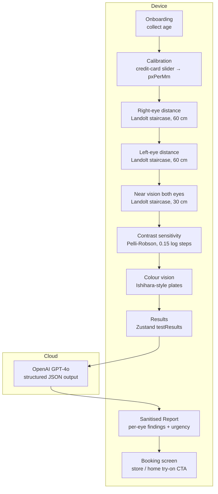

# ClearSight

A React Native (Expo) at-home vision-screening app. Walks the user through a
calibrated 5-minute eye test on their own phone and returns a plain-English
report — per-eye acuity (Snellen + estimated diopter range), contrast
sensitivity, and colour-vision check — generated by GPT-4o.

> **Disclaimer.** ClearSight is a screening aid, not a medical device. Results
> are estimates only. Always consult a qualified optometrist for a clinical
> diagnosis or prescription.

> **Note on commit history.** This repository was initialised after the
> working build was complete, so the history shows a single squash commit
> rather than incremental development. The full design rationale and the
> sequence of design decisions (calibration → adaptive staircase → contrast
> staircase → diopter lookup → GPT report) is documented in this README and
> in `ONE_PAGER.md`.

---

## Run it in three commands

```bash
git clone <this-repo> && cd ClearSight
cp .env.example .env   # then paste your OpenAI key into .env
npm install && npx expo start
```

Scan the QR code with **Expo Go** (iOS / Android), or press `i` / `a` for a
simulator. If your phone and laptop are on different Wi-Fi, use
`npx expo start --tunnel` instead.

---

## Environment variables

All config goes in `.env` at the repo root. Never hardcode secrets.

| Variable | Required | Purpose |
|---|---|---|
| `EXPO_PUBLIC_OPENAI_API_KEY` | yes | OpenAI key used by `api/report.ts` to call `gpt-4o` for the structured report. The `EXPO_PUBLIC_` prefix is required so Expo's bundler inlines it into the client. |

A template is provided as `.env.example`. The real `.env` is `.gitignore`-d.

> **Security note for production.** Bundling an OpenAI key into a mobile app
> exposes it to anyone who downloads the binary. For anything beyond a
> hackathon demo, put the OpenAI call behind a small backend (Cloudflare
> Worker, Supabase Edge Function, AWS Lambda) and have the app call your
> proxy. The OpenAI client in `api/report.ts` is the only file that needs
> to change.

---

## Architecture



State lives in **Zustand** (`store/session.ts`): `pxPerMm`,
`calibrationConfidence`, `age`, `hasCompletedAcuityPractice`, and
`testResults`. Every screen reads / writes through the store; nothing is
passed around as navigation params. The OpenAI report is the only network
call in the entire flow.

---

## Tech stack

- **Mobile:** Expo SDK 54, React Native 0.81, TypeScript 5.9
- **Navigation:** `@react-navigation/native` + native stack
- **State:** Zustand
- **Stimulus rendering:** `react-native-svg` (Landolt rings + 8-segment
  response wheel) with sRGB gamma correction for accurate Weber contrast
- **Calibration UI:** `@react-native-community/slider`
- **AI report:** `openai` SDK calling `gpt-4o` in JSON-mode, with
  schema-allowlist sanitisation and a deterministic fallback report on any
  network / parse failure

The AI layer is intentionally **model-agnostic** — the same payload contract
can be served from AWS Bedrock (Claude / Llama) or a hosted SageMaker
endpoint with a one-file swap of `api/report.ts`.

---

## Project layout

```
ClearSight/
├── App.tsx                      # NavigationContainer + native stack
├── index.ts                     # Expo entry
├── store/
│   └── session.ts               # Zustand: pxPerMm, age, testResults, formatRange()
├── lib/
│   └── acuity.ts                # MAR → diopter lookup tables (distance + near)
├── components/
│   ├── LandoltRing.tsx          # SVG stimulus (gamma-corrected, size in mm)
│   ├── ResponseRing.tsx         # 8-segment tappable answer wheel + hint mode
│   ├── InstructionCard.tsx      # Animated full-screen prompt between tests
│   └── CalibrationRequired.tsx  # Guard for invalid pxPerMm
├── screens/
│   ├── OnboardingScreen.tsx     # Age input + start
│   ├── CalibrationScreen.tsx    # Card-against-screen calibration
│   ├── TestRunner.tsx           # 11-step orchestrator (5 tests + 6 instruction cards)
│   ├── AcuityTest.tsx           # Adaptive staircase: 3-trial warm-up + 10 scored
│   ├── ContrastTest.tsx         # 0.15 log-unit Pelli-Robson, 2-pass / 2-fail
│   ├── ColourTest.tsx           # 4 Ishihara plates from assets/color/
│   ├── ResultsScreen.tsx        # Diopter card + per-eye findings + urgency
│   └── BookingScreen.tsx        # Store cards + restart
├── api/
│   └── report.ts                # OpenAI gpt-4o, JSON-mode, sanitised Report
├── assets/
│   └── color/                   # Ishihara plate PNGs
├── .env.example                 # template (no secrets)
├── ONE_PAGER.md                 # submission summary
└── package.json
```

---

## How the math works

### Calibration

The user sizes a vertical credit-card outline (ISO/IEC 7810 ID-1: 85.6 mm
long edge) against a real card held against the screen. The slider's pixel
height divided by 85.6 gives `pxPerMm`. A "Skip" path falls back to
`PixelRatio.get() * 160 / 25.4` and flags the session as
`calibrationConfidence: 'low'`.

### Acuity stimuli

Landolt-C diameter is computed per render from viewing distance and MAR
(Minimum Angle of Resolution, in arc-minutes):

```
diamMm = (distanceCm / 100) × tan(MAR / 60 × π/180) × 1000 × 5
```

Doubling the viewing distance doubles the physical ring size, holding
angular subtense — and therefore the actual acuity threshold — constant.
The luminance of the ring is **gamma-corrected** (γ = 2.2) so the Weber
contrast on screen matches the nominal value.

### Adaptive staircase

A **transformed up-down staircase** with a 2-of-3 confirmation rule per
level:

- 3-trial guided warm-up, shown only on the user's first session, with the
  correct gap highlighted in green
- 10 scored trials per acuity test
- Advance one level after 2 correct at the current level
- Drop one level after 2 wrong at the current level
- Threshold = mean of the last 4–6 reversal points (fall back to mean of
  last 4 levels if fewer than 2 reversals occurred)
- No two consecutive trials show the gap in the same orientation

### MAR → diopter

A clinically calibrated lookup table in `lib/acuity.ts`, snapped to
quarter-dioptre steps to match how prescriptions are actually written:

| MAR | Snellen | Distance estimate (60 cm) | Near estimate (30 cm) |
|---|---|---|---|
| 1.0  | 6/6  | 0.00 D                | 0.00 D       |
| 1.25 | 6/7.5| -0.25 to -1.75 D      | 0.00 D       |
| 1.5  | 6/9  | -1.00 to -2.00 D      | -0.25 to +0.25 D |
| 2.0  | 6/12 | -1.25 to -2.25 D      | +0.25 to +0.75 D |
| 3.0  | 6/18 | -1.75 to -2.75 D      | +0.75 to +1.50 D |
| 4.0  | 6/24 | -2.00 to -3.50 D      | +1.25 to +2.00 D |
| 6.0  | 6/36 | -2.00 to -5.00 D      | +1.50 to +2.50 D |
| 10.0 | 6/60 | -3.00 to -7.00 D (capped) | +2.00 to +3.00 D |

When MAR ≥ 10 the test is at its measurement floor; the report is flagged
`capped: true` and the report layer surfaces a "see an optometrist for the
exact value" note.

### Contrast sensitivity

Ten log-spaced contrast levels from 1.00 down to 0.044 (0.15 log-unit
steps, Pelli-Robson convention). 2-correct-to-advance, 2-wrong-to-stop. The
result is reported as `log CS` with a flag:

| log CS | Flag |
|---|---|
| ≥ 1.20 | normal |
| ≥ 0.85 | mild reduction |
| < 0.85 | significant |

If the user passes the lowest level we can render, we set `atLimit: true`
and the report notes the true threshold may be even lower.

### Report generation

`api/report.ts` builds a payload from the Zustand store and calls
`gpt-4o` with `response_format: { type: 'json_object' }`. The system prompt:

- Bans diagnostic language ("suggests", "may indicate" only)
- Forbids paraphrasing diopter ranges — they are pre-formatted on the
  client and the model must copy them verbatim
- Forces per-eye findings (one entry per eye for distance vision)
- Triggers `urgent` referral on inter-eye gap > 2 Snellen lines,
  significant contrast loss, or ≥ 4 colour errors
- Uses `patient.age` for context (e.g. age ≥ 40 with reduced near vision
  is framed as the typical reading-focus shift, not a problem)
- Bans clinical labels ("presbyopia", "myopia", etc.) — describe behaviour
  only

The response is parsed and sanitised against allowlists (`urgency`, `flag`,
`eye`); on any failure (no key, network error, malformed JSON, schema
violation) it returns a deterministic `FALLBACK_REPORT`.

---

## Sample input and expected output

### Sample `testResults` payload sent to GPT-4o

```json
{
  "patient": { "age": 28 },
  "rightEye": {
    "distanceSnellen": "6/12",
    "distanceDiopterRange": "-1.25 to -2.25 D",
    "cappedNote": null
  },
  "leftEye": {
    "distanceSnellen": "6/9",
    "distanceDiopterRange": "-1.00 to -2.00 D",
    "cappedNote": null
  },
  "nearVision": {
    "snellen": "6/6",
    "diopterRange": "Within normal range",
    "cappedNote": null,
    "note": "tested both eyes together at 30cm"
  },
  "contrast": { "flag": "normal", "logCS": 1.65, "atLimit": false },
  "colourErrors": 0
}
```

### Expected sanitised `Report` returned to the UI

```json
{
  "summary": "Both eyes show mild blurring at distance, with the right slightly weaker than the left. Near vision and colour vision look typical.",
  "findings": [
    {
      "test": "Distance Vision — Right Eye",
      "result": "6/12",
      "plain": "Your right eye shows mild blurring at distance; estimated -1.25 to -2.25 D.",
      "flag": "amber",
      "eye": "right"
    },
    {
      "test": "Distance Vision — Left Eye",
      "result": "6/9",
      "plain": "Your left eye is slightly sharper at distance; estimated -1.00 to -2.00 D.",
      "flag": "amber",
      "eye": "left"
    },
    {
      "test": "Near Vision",
      "result": "6/6",
      "plain": "Reading-distance vision looks typical for your age.",
      "flag": "pass",
      "eye": "both"
    },
    {
      "test": "Contrast Sensitivity",
      "result": "log CS 1.65",
      "plain": "Contrast sensitivity is in the normal range.",
      "flag": "pass",
      "eye": null
    },
    {
      "test": "Colour Vision",
      "result": "0 errors",
      "plain": "No colour-vision deficiency detected.",
      "flag": "pass",
      "eye": null
    }
  ],
  "recommendation": "Book a routine in-store refraction within the next month to confirm your distance prescription.",
  "urgency": "soon",
  "patternNote": "Distance vision is mildly reduced in both eyes while near vision is sharp."
}
```

The Results screen renders the diopter card directly from the Zustand
store (never from GPT) and the findings cards from the sanitised
`findings` array, colour-coded by `flag` and badged by `eye`.

---

## Scripts

```bash
npm start           # expo start
npm run ios         # expo start --ios
npm run android     # expo start --android
npm run web         # expo start --web
npx tsc --noEmit    # type-check the whole project
```

---

## What is intentionally out of scope

- Astigmatism axis, binocular fusion, peripheral fields, intra-ocular
  pressure — anything that needs hardware ClearSight cannot have
- A single-number prescription. We always return a **range** to discourage
  using the screening as a substitute for a real refraction
- User accounts, history, sync. The session is on-device only; the only
  network call is the (anonymous) GPT-4o report request
